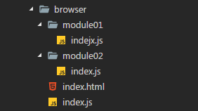

# CH1. Modules 模塊 - 

## 機器人工程師的模塊學說

    我跟著小霞回到家裡，這裡距離我們的店鋪只需徒步行走１５分鐘，她進行大門的指紋與聲波辨識然後推開大門。太陽還高掛在天上。
    「妳這樣子，生意怎麼可能好起來。」
    「反正平常也沒什麼客人。」
    「...」
    她快步的走進家中的工作室，我進門的瞬間突然一到紅色的光線向我掃射過來。從頭到腳掃瞄過我的身體後，天花板突然發出聲音。
    「歡迎回來，Joy 先生。」
    通常這個近似人聲的訊息會透過植入體內的電腦直接向腦中發送。但我沒有植入性個人電腦，所以進入家中時會被認為成無法辨識的陌生人，因此住宅系統會進行活體掃描，確保來者在住宅中有註冊資料。畢竟，沒有植入性電腦就無法追蹤，而且似乎是非法的一件事情...
    我能夠在小霞家中留有註冊資料是因為我住在這裡，雖然也到這裡不過兩個月就是了。
    「妳真的很喜歡機器人，是不是？」
    我走進她的個人工作室，裡面有滿滿的機器設備零件以及一台打造到一半的機器人。
    小霞已經有經營中的工作室，負責機器的維修與保養。而家裡的工作室更像是她組裝或研究感興趣的機器人的場所。她常常窩在裡面，三更半夜還不睡覺。
    「快近來。」
    「是、是。」
    因為工作室中只有一張椅子，我選擇將背靠在牆上。
    「這是我最近在打造的機器人，兔兔３號。而這個，是她的動力來源，也就是這個機器人的心臟。」
    兔子大概是僅次於機器人，她最喜歡的東西。這台打造到一半的機器人，是一台機械寵物。會模擬真實兔子的用運動動作、習性，但個性更像隻貓咪的樣子。前天她是這麼跟我介紹的。
    「打造機器人的時候，最常發生的事情就是零件之間並不相容。像是這個動力核心只能夠跟三種特定的機器人主機板結合。因為這個零件的輸出端跟主機板的接收端不相容。之所以要這樣設計的原因，是因為零件內部的運作邏輯相當複雜，就連組裝機器人多年的我也不可能全部理解零件的原理。
    所以為了讓不了解原理的人也能夠使用這些零件，需要在零件上設定輸出的協定，接收端自然也要設定接收的協定，這樣一來就不會因為零件內部未知的運作原理破壞了整台機器人。」
    「感覺就像是堆疊積木時，出現了圓柱型突出就只能結合圓柱型插孔，出現三角型突出就只能結合三角型插孔的感覺。」
    「沒錯，Webpack 的模塊感覺也是這樣，你需要在 JavaScript 中設定輸出端與輸入端的協定，她們才會彼此正確的結合。差別在於，輸出端是寫著『我想丟出什麼東西』、輸入端則是『我該去哪裡找到這個東西』。而且這個結合是可以不斷堆疊的，例如 A 模塊插入 B 模塊中，接著 B 模塊再插入 C 模塊中，就會得到一份包含 A、B 模塊在內的 C 模塊。
    這還有另外一個好處，就是在開發組件的時候可以將組件拆分成更小的組件，每一個組件更加精巧、好維護。聽說很多人推崇每個組件只要負責單一功能，這樣的設計方式呢。
    這樣的組件就是...恩...discrete chunks of functionality！」
    感覺最後面她的眼神不斷游移，大概偷偷用植入性個人電腦在查詢單字吧。恩...英文翻譯過來是『功能分離塊』。
    「但是 JavaScript 是沒有實體的，我要怎麼做出需要的突出與插孔？」
    「問的好，有認真在學喔！」
    她笑的異常燦爛，頻頻點頭。接著開口:
    「在 JavaScript 的模塊的突出與插孔大概有兩個主要的方式。分別是在瀏覽器與在電腦系統上運行的時候使用。」
    她拿出了筆記型電腦。

## 瀏覽器、Node 與 Webpack 的模塊引入方式

    「首先練習看看在瀏覽器上使用模塊的做法，從 JavaScript 的 ES6 版本之後，JavaScript 在瀏覽器上就支援 import ... from ... 輸入以及 export 輸出的方式。」



```js
module01/index.js 丟出資料

// module01/index.js

const output = {
    module01Function: function() {},
    module01String: 'module01',
}

module.exports = output

// 或
module.exports = {
    module01Function: function() {},
    module01String: 'module01',
}
```

```js
module02/index.js 丟出資料

// module02/index.js

const module01Obj = require('../module01/index.js')

const output = {
    module02Function: function() {},
    module02String: 'module02',
    module01: module01Obj,
}

module.exports = output

// 或
module.exports = {
    module02Function: function() {},
    module02String: 'module02',
    module01: module01Obj,
}
```
```js
index.js 引入 module02/index.js

//index.js

const module02 = require('./module02/index.js')
// 或
const module02 = require('./module02/index')
// 或
const module02 = require('./module02')

console.log(module02)

結果:
{
    module02Function: function() {},
    module02String: 'module02',
    module01: {
        module01Function: function() {},
        module01String: 'module01',
    },
}
```
    
    
